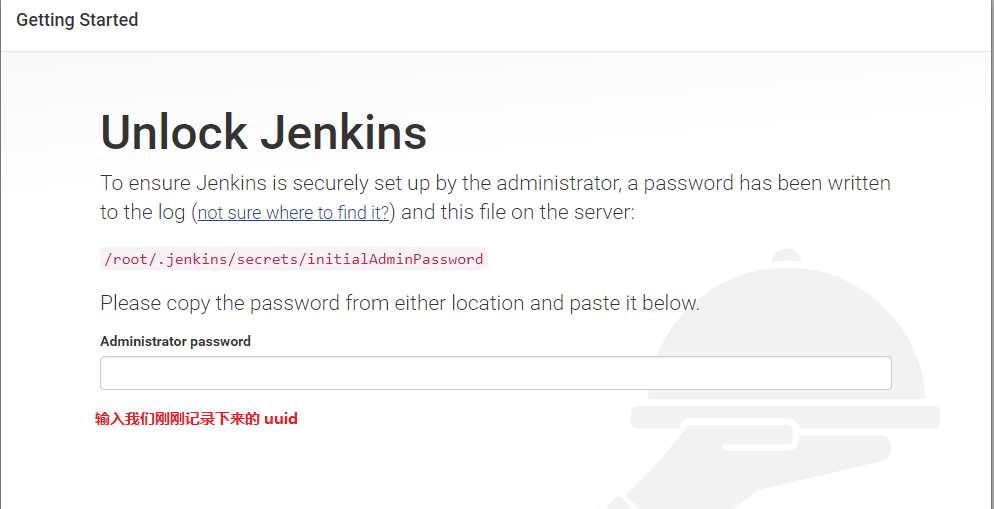
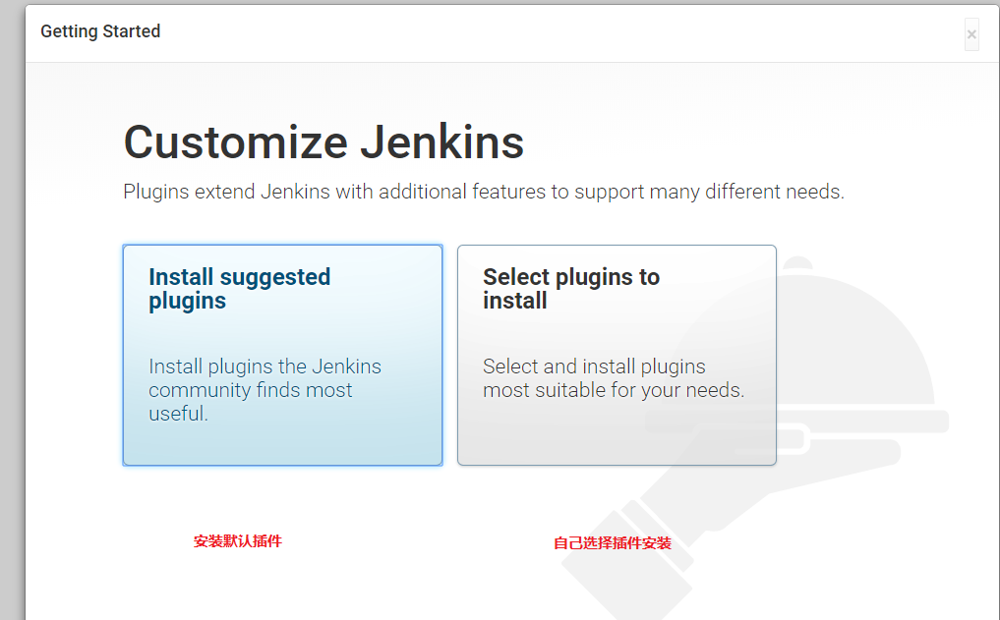
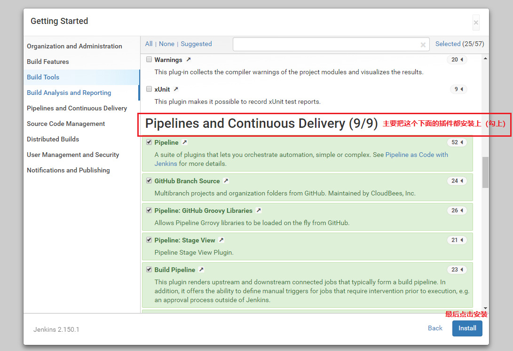

# Jenkins安装，为了更好的与Kubernetes集成建议安装在配置好了kubectl命令的机器上
## 一、下载Jenkins
```bash
#下载  war 包
wget http://mirrors.jenkins.io/war-stable/latest/jenkins.war    
#启动 Jenkins，注意：首次启动在上下三行 * 号内，有一行 uuid 需记录下来，作为首次登录时使用
java -jar jenkins.war --httpPort=9999   
#访问测试  ，首次访问要填写我们上一步记录的 uuid
http://localhost:9999   
```
#### 填写uuid

#### 选择安装方式
 
#### 选择插件
